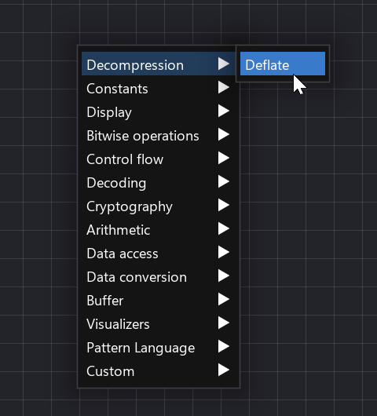

# ImHex Data Processor Zlib plugin

Use Deflate in [ImHex](https://github.com/WerWolv/ImHex) Data Processor nodes.

## Usage

Right click in Data Processor window, click `Decompression -> Deflate`   

 ## License Information

[MIT](LICENSE.md)